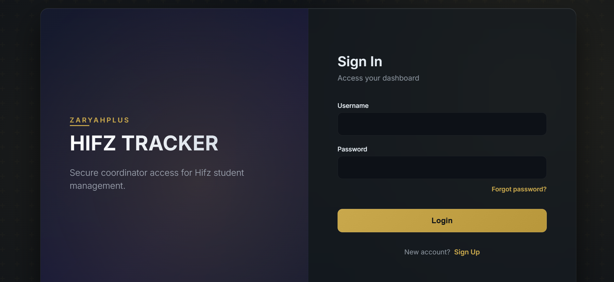
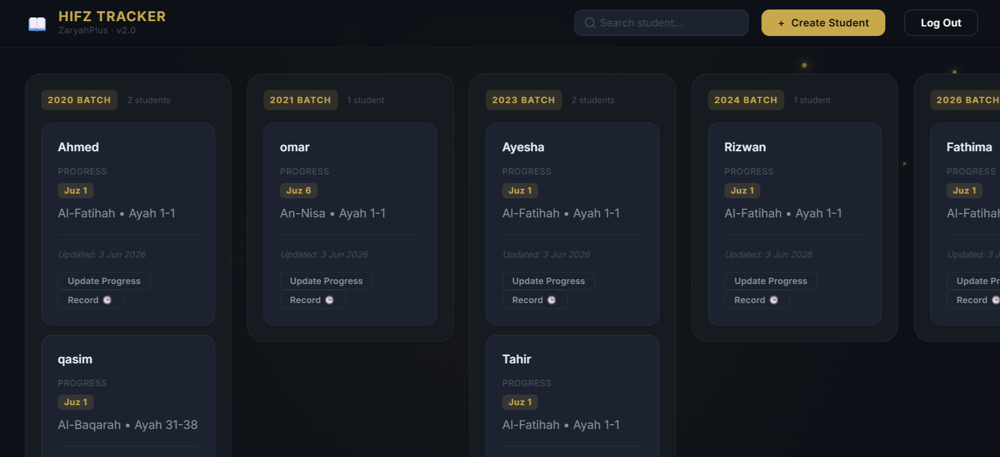
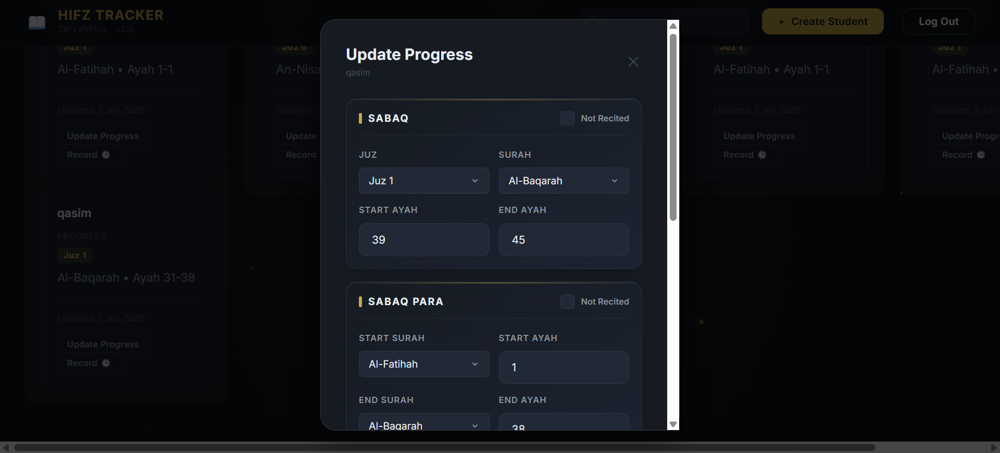
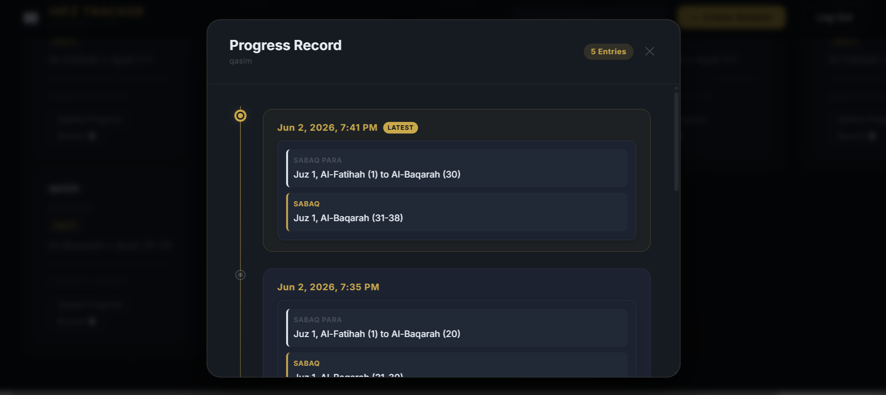

<h1 align="center">Hifz Tracker v2.0</h1>

<p align="center">
  A secure full-stack Hifz management system for tracking students, revision, progress, and records.
</p>

<p align="center">
  Hifz Tracker v2.0 was built to make student memorization tracking more organized, secure, and easier to manage. The project includes authentication, protected access, student records, progress updates, and a clean dashboard flow for daily use.
</p>

<p align="center">
  
  
  
  
  
  
  
</p>

## Project Preview

<p align="center">
  
</p>

<p align="center">
  
</p>

<p align="center">
  
</p>

<p align="center">
  
</p>

## About the Project

Hifz Tracker v2.0 is a full-stack web application built to help manage Hifz students in a more structured way. Instead of manually tracking student progress, records, and revision details, this system gives a clean digital workflow where student data can be added, viewed, updated, and managed securely.

This version upgrades the earlier tracker by adding login and authentication, protected routes, account-based access, improved backend structure, and a more complete user flow.

## Why I Built This

I built this project because Hifz progress tracking needs clarity and consistency. A student’s memorization journey has daily updates, revision records, and individual progress differences. This project was created to make that process easier to manage through a simple and secure system.

## Key Features

- 🔒 Secure login and authentication system
- 📝 Sign-up flow for new users
- 🛡️ Protected routes for authenticated access
- 📊 Student management dashboard
- ✍️ Add, view, update, and manage student records
- 📈 Track student progress and revision status
- ✨ Clean frontend interface
- ⚙️ Backend API integration
- 🗄️ Database-connected workflow
- 🛑 Error handling for invalid or unauthorized access
- 📂 Organized project structure
- 🚀 Version 2.0 upgrade from the original tracker

## What Changed in v2.0

- Added login page
- Added sign-up flow
- Added authentication logic
- Added protected access
- Improved student data management
- Improved backend routes
- Added database connection
- Added security checks
- Improved README and screenshots
- Made the project more complete and review-ready

## How It Works

```txt
Login / Sign Up
        ↓
Authentication Check
        ↓
Protected Dashboard
        ↓
Student Management
        ↓
Progress Tracking
        ↓
Database Storage
```

---

## Folder Structure

```
hifz-tracker-2/
│
├── backend/
│   ├── main.py          ← FastAPI application entry point
│   ├── database.py      ← SQLite connection + table initialization
│   ├── models.py        ← CRUD query helpers (parameterized SQL only)
│   ├── schemas.py       ← Pydantic v2 request/response validation
│   ├── requirements.txt ← Python dependencies
│   └── hifz_tracker.db  ← SQLite database (auto-created on first run)
│
├── frontend/
│   ├── index.html       ← Single HTML shell (no hardcoded student data)
│   ├── style.css        ← ZaryahPlus design system (vanilla CSS)
│   ├── script.js        ← All UI logic + API calls via fetch()
│   └── assets/          ← Static assets (icons, images)
```

---

## Installation Guide

### Prerequisites

- **Python 3.11+** — [Download](https://www.python.org/downloads/)
- A modern browser (Chrome, Firefox, Edge)

### Step 1 — Navigate to the backend folder

```powershell
cd "d:\PROJECTS\HIFZ TRACKER V2.0\hifz-tracker-2\backend"
```

### Step 2 — (Recommended) Create a virtual environment

```powershell
python -m venv venv
.\venv\Scripts\Activate.ps1
```

> On Windows PowerShell, if you get an execution policy error:
> `Set-ExecutionPolicy -ExecutionPolicy RemoteSigned -Scope CurrentUser`

### Step 3 — Install dependencies

```powershell
pip install -r requirements.txt
```

---

## Running the Backend

From inside the `backend/` folder (with venv activated):

```powershell
uvicorn main:app --reload --host 127.0.0.1 --port 8000
```

You should see:

```
INFO:     Started server process
INFO:     Waiting for application startup.
INFO:     Application startup complete.
INFO:     Uvicorn running on http://127.0.0.1:8000
```

The SQLite database file (`hifz_tracker.db`) is created automatically on first start.

---

## Running the Frontend

The frontend is pure HTML/CSS/JS — no build step needed.

**Option A — Open directly in browser:**

```
Open: d:\PROJECTS\HIFZ TRACKER V2.0\hifz-tracker-2\frontend\index.html
```

> ⚠ Some browsers block `fetch()` from `file://` URLs due to CORS.
> Use Option B if cards do not load.

**Option B — Serve with Python's built-in server (recommended):**

Open a **second terminal window** and run:

```powershell
cd "d:\PROJECTS\HIFZ TRACKER V2.0\hifz-tracker-2\frontend"
python -m http.server 3000
```

Then open: **http://localhost:3000** in your browser.

---

## API Endpoints

| Method | Endpoint | Description |
|--------|----------|-------------|
| `GET` | `/` | Health check — confirms server is running |
| `GET` | `/students` | Retrieve all students |
| `POST` | `/students` | Create a new student |
| `PUT` | `/students/{id}` | Update student progress |
| `DELETE` | `/students/{id}` | Delete a student |

### Interactive API Docs

FastAPI auto-generates interactive documentation:

- Swagger UI: http://127.0.0.1:8000/docs
- ReDoc: http://127.0.0.1:8000/redoc

---

## Example API Requests

### Create a student

```json
POST /students
{
  "full_name": "Ahmed Ali",
  "batch_year": 2025,
  "current_juz": 12,
  "current_surah": "Yusuf",
  "current_ayah": 45
}
```

### Update progress

```json
PUT /students/1
{
  "current_juz": 13,
  "current_surah": "Ar-Ra'd",
  "current_ayah": 10
}
```

---

## Troubleshooting

| Problem | Solution |
|---------|----------|
| `uvicorn: command not found` | Run `pip install -r requirements.txt` inside the venv |
| `ModuleNotFoundError: fastapi` | Make sure your venv is activated |
| Frontend shows "Could not connect to backend" | Ensure uvicorn is running on port 8000 |
| Cards don't load from `file://` | Serve frontend with `python -m http.server 3000` |
| Database not persisting | The `.db` file must be in the `backend/` folder — check DB_PATH in `database.py` |
| PowerShell execution policy error | Run: `Set-ExecutionPolicy -ExecutionPolicy RemoteSigned -Scope CurrentUser` |

---

## Testing Checklist

Use this checklist after each phase to verify the system:

```
[ ] Backend starts without errors
[ ] GET /students returns 200 OK
[ ] POST /students creates and stores a student
[ ] Student appears on the frontend without reload
[ ] PUT /students/{id} updates and persists progress
[ ] Search filters cards instantly
[ ] Refresh — students still visible (persistence check)
[ ] Backend restart — students still visible (SQLite persistence)
[ ] Laptop restart — students still visible (full persistence)
[ ] Invalid input returns professional error (not 500)
[ ] DELETE /students/{id} removes the student
```

---

*HIFZ TRACKER 2.0 — ZaryahPlus Internal Product*
